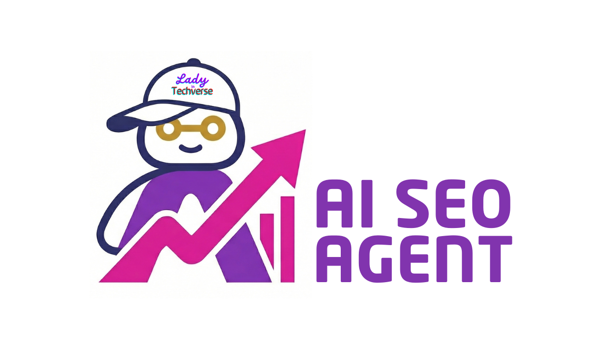

# LITV AI SEO Agent v2

Public changelog for LITV AI SEO Agent v2.

This repository is used as a simple public progress log. It does not contain
application source code, private infrastructure notes, customer data, API keys,
or deployment credentials.

## Status

LITV AI SEO Agent v2 is in active private development.

Current focus:

- AI-assisted SEO audit workflow
- Dashboard experience and account controls
- Fix Pack delivery flow
- Beta tester onboarding
- Security, privacy, and deployment readiness

## Changelog

### 2026-08-12

- Migrated AI model routing ahead of provider retirement schedules. Audit
  quality and regional data routing are unchanged.
- Strengthened release verification and deployment checks.
- Expanded automated security monitoring coverage.
- Refreshed the Privacy Policy and Terms of Service to reflect the current
  AI provider set.

### 2026-05-18

- Expanded beta tester onboarding materials.

### 2026-05-14

- Prepared beta tester access materials.
- Drafted beta tester email copy.
- Continued private dashboard and delivery readiness work.

### 2026-05-13

- Continued dashboard tooling work.
- Refined support and upload handling.
- Added crawler and visibility checks to support pre-audit review workflows.

### 2026-05-12

- Completed a staging-focused RAG and dashboard readiness checkpoint.
- Verified preview-first testing flow.
- Kept production migration gated behind security and delivery checks.

### 2026-05-11

- Continued autofix and trust-methodology work.
- Preserved preview-first development boundaries.
- Captured the next private implementation gates.

## Public Notes

- This repo is intentionally minimal.
- Sensitive implementation details are tracked privately.
- Public updates here are written to show direction without exposing internals.
